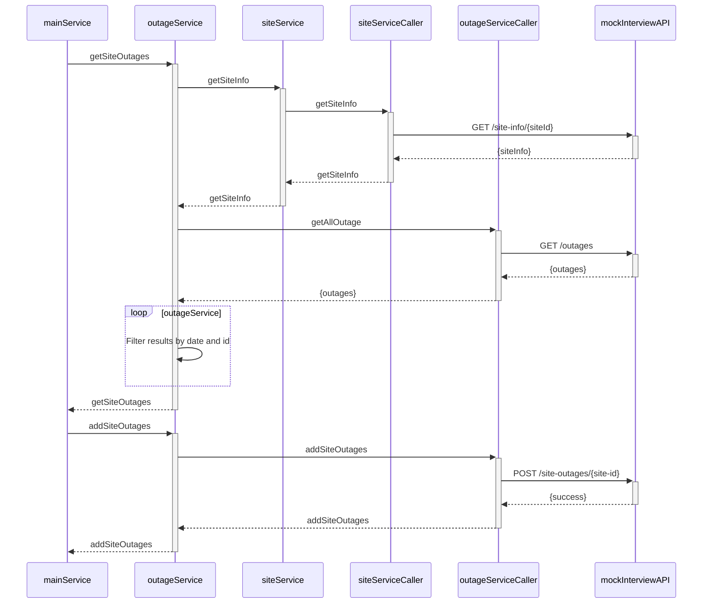

# krakenflex-code-assignment
Krakenflex Code Assignment

This is a small program which retrieves outages for the given spesific site id. It retrieves the outages from krakenflex interview mock api, then it filters the results with site information.
# User Story
This section explains user story.
### Retrieve and Filter Outages for Spesific Site Id
***As a*** user of the system.   
***I want to*** be able to retrieve outages for a specific site ID.      
***So that*** I can view outage information relevant to that site.
### Acceptance Criteria
* ***Given*** the Krakenflex Interview Mock API is accessible
* ***When*** I provide a spesific site ID as input
* ***Then*** the program should retrieve outage data from the API for the given site ID
* ***And*** filter the results based on the site information
* ***So that*** I can see a list of outages associated with the specified site information.


# Sequence Diagram
This section explains application flow.

# Setup Guide
This section explains how to run this small program in local environment.
### Requirements
* Node Version: v18.10.x   
* Npm Version: v8.10.x
### Installing Dependencies
```npm install```
### Running Tests
```npm run test```
### Environment Variables
```
[REQUIRED]
KRAKENFLEX_SERVICE_URL=api-url
KRAKENFLEX_API_KEY=api-key
KRAKENFLEX_SITE_ID=example-site-id
KRAKENFLEX_DATE_LIMIT=2030-01-14T03:42:56.411Z
```
### Running Application
```npm run start```
